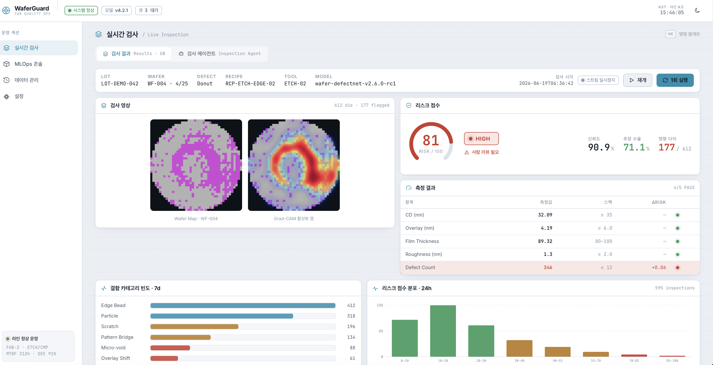
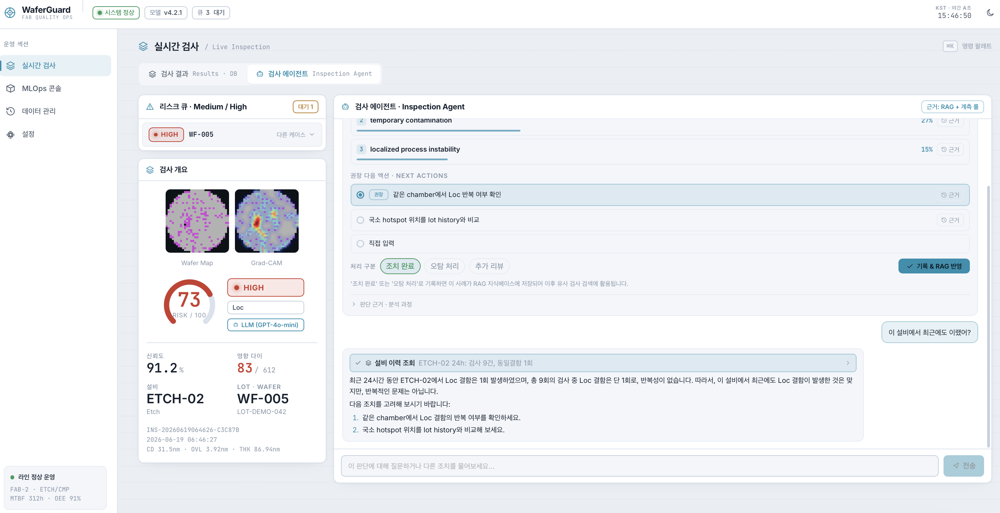
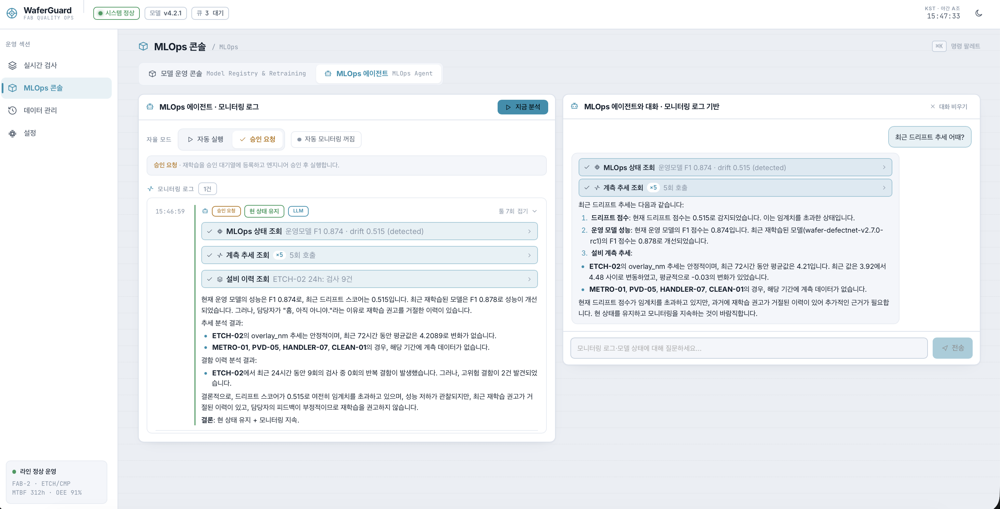
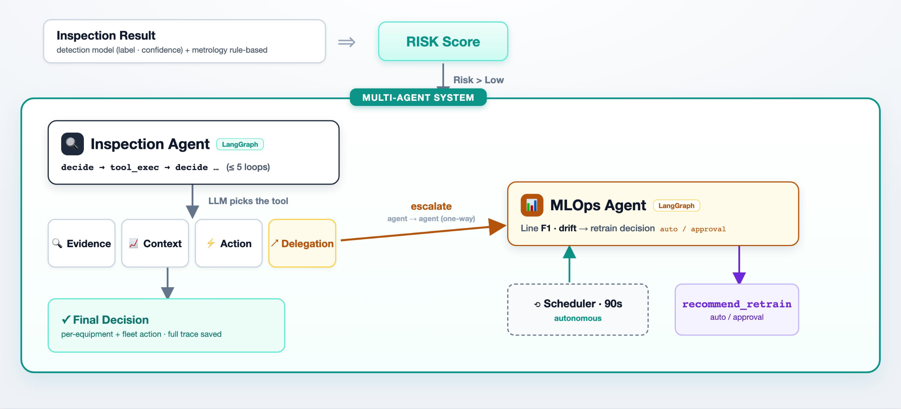
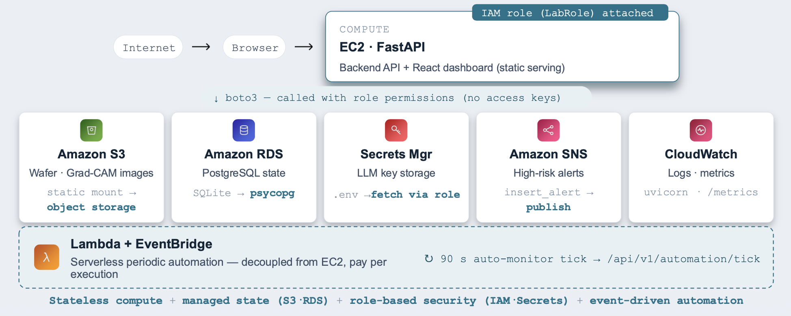

# WaferGuard

**스마트 팩토리 운영 보조 멀티 에이전트 시스템**

WaferGuard는 반도체 공정의 이상 상황에 대응하는 멀티 에이전트 시스템입니다. 결함을 분류하는 데서 멈추지 않고, RAG 기반으로 추정 원인과 최적의 대응방안을 판단하고 실제 운영 조치로 연결하고, 엔지니어의 판단을 다시 학습 데이터로 활용하여 지속적으로 개선합니다.

## 📝 Overview

탐지 모델이 충분히 고도화된 지금, 현장에서 비용이 발생하는 지점은 결함을 **탐지**하는 단계가 아니라 **다음 조치를 결정**하는 단계입니다.

이 판단은 지금까지 엔지니어의 판단에 의존해왔습니다. WaferGuard는 이 운영 판단을 RAG 기반 멀티 에이전트로 자동화합니다.

### ⭐️ Key Features
- **Anomaly Detection** :  탐지 모델을 통해 룰 기반으로 리스크 점수를 계산하고, 높은 리스크의 결함 케이스에서 검사 에이전트를 자동으로 호출합니다.
- **Inspection Agent** : 검사 에이전트는 내부 문서, 기존 사례를 검색하고, 공정 라인의 변화를 추적하여(RAG) 추정 원인과 최적의 대응방안을 추천합니다.
- **Multi-agent Delegation** : 탐지 모델의 오탐으로 판단될 경우나, 데이터 분포의 변화가 클 경우 자동으로 **MLOps 에이전트로 위임**되어 탐지 모델의 재학습 여부를 판단합니다.
- **MLOps Agent** : MLOps 에이전트는 주기적으로 호출되어 탐지 모델과 데이터 드리프트를 모니터링하고, 모델의 재학습 여부를 자율적으로 판단합니다.
- **Human-in-the-Loop Learning (RAG)** : 담당 엔지니어가 내린 판단은 모두 다시 DB에 저장되어, 에이전트가 판단을 내릴 때 검색되는 사례로 이용됩니다.

## 🎯 Demo

### 🔎 Live Inspection

- Wafer map, Grad-CAM activation과 측정 결과가 스트리밍됩니다.
- 7일치 결함 카테고리 빈도와 24시간 리스크 분포를 함께 표시합니다.

### 🤖 Inspection Agent

- Medium/High 리스크 케이스가 발생할 경우 Agent가 호출되어 추정 원인과 대응 방안을 추천합니다.
- 엔지니어의 판단 결과는 다시 RAG로 학습됩니다.

### 📈 MLOps Agent

- 문제가 개별 wafer 차원을 넘어서면, Inspection Agent가 **MLOps Agent를 호출**합니다.
- MLOps Agent는 자체 루프를 돌려 **fleet-level 재학습 권고**를 반환합니다.
- **자율성 다이얼**: Auto · Request approval— 운영자가 자동화 모드를 선택합니다.

## ✍️ Agentic Flow


## 🧑‍💻 Tech Stack

| 영역 | 구성 |
|------|------|
| Backend | FastAPI · **LangGraph StateGraph** (ReAct 루프) |
| LLM | **GPT-4o-mini via Luxia Gateway** — text + image 멀티모달 |
| RAG | Luxia embedding (1024-d) · cosine · rerank · SQLite BLOB 인덱스 |
| Frontend | React + Vite 운영 대시보드 |
| Storage | SQLite · **9개 테이블** (inspections · agent_traces · pending_approvals · rag_documents · model_registry · retraining_jobs · drift_events · alerts · handoff_reports) |

## 🛜 AWS Deployment

하나의 **EC2 인스턴스**가 IAM 역할을 통해 **7개의 AWS 서비스를 오케스트레이션**합니다.


| AWS 서비스 | 역할 | 연동 방식 |
|------------|------|-----------|
| **EC2** | FastAPI 백엔드 + React 대시보드 정적 서빙 (compute) | IAM 역할 attach |
| **S3** | wafer / Grad-CAM 이미지 저장 | 로컬 정적 마운트 → object storage |
| **RDS (PostgreSQL)** | 검사 이력·에이전트 상태 저장 | SQLite → psycopg |
| **Secrets Manager** | LLM API 키 보관 | `.env` 대신 역할로 fetch |
| **SNS** | High-risk 알림 fan-out (Slack 등) | `insert_alert` → publish |
| **CloudWatch** | 로그·메트릭 | uvicorn 로그 · `/metrics` |
| **Lambda + EventBridge** | 90초 주기 auto-monitor (EC2와 분리, 실행당 과금) | → `/api/v1/automation/tick` |

> 실제 EC2 배포 단계(인스턴스 준비 → systemd 등록)는 [`docs/AWS_Deploy_Guide.md`](docs/AWS_Deploy_Guide.md)를, 마이그레이션·비용 상세는 [`docs/`](docs/)의 AWS 문서를 참고해주세요.

## Prerequisites

| 도구 | 최소 버전 |
|------|-----------|
| Python | 3.11 |
| Node.js | 18 이상 |
| npm | 9 이상 |

## Local Demo Guide

### 1. Clone Repository & Install Dependencies
```bash
git clone <저장소 URL>
cd WaferGuard

conda create -n waferguard python=3.11 -y
conda activate waferguard
pip install -r requirements.txt
```

### 2. Install Frontend Dependencies
```bash
cd frontend
npm install
cd ..
```

### 3. Set Luxia Gateway API Key
프로젝트 루트에 `.env` 파일을 만들고 Luxia Gateway API 키를 넣어줍니다.
```bash
# .env
LUXIA_API_KEY=발급받은_키
```

## 4. Run Backend & Frontend

터미널 2개로 백엔드와 프론트엔드를 각각 실행합니다.

**터미널 1 — 백엔드 (FastAPI :8000)**
```bash
conda activate waferguard
uvicorn app.main:app --host 127.0.0.1 --port 8000
```

**터미널 2 — 프론트엔드 (Vite :5173)**
```bash
cd frontend
VITE_API_BASE_URL=http://127.0.0.1:8000 npm run dev
```

**접속 주소**
```
Dashboard : http://127.0.0.1:5173
API docs  : http://127.0.0.1:8000/docs
Health    : http://127.0.0.1:8000/health   →  {"status":"ok"}
```

## 5. Smoke Test
```bash
# 백엔드가 실행 중인 상태에서 주요 엔드포인트 통합 테스트
conda activate waferguard
python scripts/smoke_test.py

# 프론트엔드 빌드 검증
cd frontend && npm run build
```

## 6. Project Structure

```
app/
  main.py              # FastAPI 앱. 모든 route를 정의하고 service 모듈로 위임
  schemas.py           # Pydantic 요청 모델
  services/
    pipeline.py        # POST /api/v1/inspect 핵심 흐름 오케스트레이션
    agent.py           # LangGraph 기반 Agent 실행 루프
    tools.py           # Agent가 호출하는 도구 정의 (TOOL_REGISTRY)
    rag.py             # 로컬/벡터 case 유사도 검색 (Top-3)
    risk.py            # risk score / level 계산
    action_card.py     # metrology rule 평가 + Action Card 생성
    mlops.py           # drift/retrain/promote/rollback 시뮬레이션
    synthetic_wafer.py # wafer map / Grad-CAM / ROI 이미지 생성
    luxia_client.py    # Luxia Gateway LLM 클라이언트 (chat/embedding/rerank)
    aws.py             # S3 / SNS / Secrets Manager 연동 (boto3, IAM 역할)
    storage.py · db.py # SQLite 접근 (init_db + 9개 테이블)
  data/                # 평가 fixture, RAG eval set, WM-811K subset
frontend/
  src/App.jsx          # 운영 대시보드
infra/
  lambda/automation_tick.py  # EventBridge 주기 자동화 Lambda
scripts/
  smoke_test.py        # 통합 스모크 테스트
  build_wm811k_subset.py  # LSWMD.pkl에서 WM-811K subset 추출
docs/                  # AWS 배포·마이그레이션·비용 가이드
outputs/               # 런타임 산출물 (이미지/DB). gitignore, 기동 시 자동 생성
```
